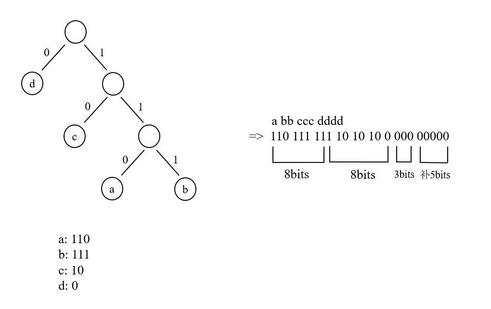

# 简易文件压缩器

## 1 文件压缩与哈夫曼编码

所谓文件压缩，其实就是将对应的字符编码转换为另一种占据字节数较少的编码来进行存储。举个例子：有一串文本 aaaabbbccd ，如果将这串字符原封不动地存放在文件中，它所占据的将会是至少10个字节(为什么说是至少，因为还有一些必要的文件信息要保存)。因此，就有人尝试着要以重新编码，然后再存储的方式来节约宝贵的磁盘空间以及传输时间。

**哈夫曼编码**就是被设计用来节省编码所占空间的一种数据结构。如果一篇文章由10000个字符构成，如果采用等长的方式对每个字符进行8位编码，那么需要80000位。而实际上每个字符出现的频率不一样，如果将频率高的字符进行较短编码，频率低的字符进行较长编码，那么存储效率则能够提高。具体原理不在本demo的讨论当中。

## 2 大致实现

### 2.1 哈夫曼树

对于一个哈夫曼树结点，将其域分别设为：字符、权值、左结点、右结点、是否为叶子结点的标志位。文本文件中的字符都在哈夫曼树的叶子结点中，而非叶子结点则是由生成哈夫曼树的中间过程所生成的。

### 2.2 最小堆

由于哈夫曼树每次都要取出树中的两个最小权值的结点，因此考虑用**最小堆**实现，将结点都存放至最小堆中，每次top和pop两个结点，直到最小堆中只有一个元素时，该元素就是最终的哈夫曼树根结点。

### 2.3 压缩器

1. 遍历待压缩的.txt文本文件，统计字符及其频数；
2. 根据字符及其频数(权值)，构建哈夫曼树并生成每个字符的哈夫曼编码；
3. 读入待压缩的文本文件，对于其中的每个字符，获取其哈夫曼编码，并将编码值存放到字符缓冲区中；
4. 当待压缩文本文件读取完毕时，将字符缓冲区中存放的字符输出到压缩文件.huffman中；
5. 将字符及其频数写入.config配置文件中(具体作用后述)。

### 2.4 解压器

1. 根据.config配置文件，统计原未压缩文件中的字符及其频数；
2. 根据上一步得到的字符及其频数构建哈夫曼树；
3. 读入已压缩的.huffman文本文件，根据每个字节为0/1，从哈夫曼树结点处向左/右走。当走到哈夫曼树叶子结点时，表示当前读入的bits已经构成了一个原未压缩文件中的字符，因此，将该字符存放到字符缓冲区中，并且让当前结点重新指向哈夫曼树根结点。同时，将字符的出现次数-1；
4. 当所有字符都已经取过了的时候，代表已经将压缩文件恢复至原文状态，此时，将字符缓冲区中存放的字符输出到.decompress解压文件中。

## 3 关键点

### 3.1 补全字节

因为压缩阶段是根据哈夫曼编码生成字节的bits，所以前面的字符都能够完整"凑够"每一个字节。然而，最后一个字符可能凑不成一个完整的字节，因此，如果最后一个字符生成完bits之后，bit数不到8，就要在后面补0。

比如，对于字符串`abbcccdddd`：



生成哈夫曼编码时，最后的`ddd`没办法凑成一个完整字节，因此要补5个0。

而在解压阶段，当读入压缩文件时，虽然可以根据编码"0"判断是字符d，但是本应该读4个0生成写入解压文件的4个d，结果因为补了5个0，就要生成9个d，造成错误。因此，应该先统计d的总次数为4，每读一个编码"0"时，就把d的次数-1，减到0时就直接终止，后面补的0自然就忽略掉了。这就是要将字符及其频数写入配置文件的原因。

### 3.2 位运算

#### 3.2.1 压缩

文本文件以字符形式存放数据，而一个字符占一个字节，因此，在压缩阶段，要根据每个字符的哈夫曼编码，将若干个字符的哈夫曼编码不断"融进"一个字节中。如下图：


用于容纳哈夫曼编码的一个字符记为ch。a bb的哈夫曼编码为`110 111 111`，当走到倒数第二个1时，已经"凑满"ch的8个bits了，这个时候就要把这个ch放到缓冲区，同时，将ch重置为0，在下一轮时，重新将未编码完成的b，和ccc、部分的d，一起拼凑成一个新的字节。

#### 3.2.2 解压

在解压阶段，读取压缩文件时按字符(字节)读取。那么，要根据读入的字符**从高到低**判断每一位是0还是1，如果是0，哈夫曼树结点就往左走，否则，往右走。当哈夫曼树结点为叶子结点时，就将这个结点所代表的原始字符放到缓冲区，同时将这个字符应该出现的次数-1，并重置当前结点为根结点。如下图：


对于已经压缩好了的字节序列，读进第一个字节`110 111 11`，此时应该不断取出这个字节的最高位、次高位、次次高位...然后根据它为0/1移动哈夫曼树结点。那么，如何才能每次**从高到低**取出当前的"最高位"？本demo采取的方式是，每次都把当前**ch字符的副本逻辑右移7位**，如根据`1101 1111`生成`0000 0001`，这样就取到了当前最高位的1。哈夫曼树结点移动完毕后，将这个**ch字符本身左移1位**，如`1101 1111`变成`1011 1110`，重复上述过程，又取到最高位的1，然后ch变成`0111 1100`。之后取到最高位的0，然后左移一位变成`1111 1000`。这个时候，从根结点出发按`110`移动，已经走到了哈夫曼树的叶子结点，因此，将叶子结点对应的字符a输出到缓冲区，然后，重置当前结点为根结点，继续根据后续编码生成字符b。按bit读一个字节需要8次，那么这8次读完之后，就直接读入文件的下一个字符。此时虽然"跨字节"读取，但是哈夫曼树结点信息依然保留着，所以继续重复上述过程即可。如上图中第一个字节读完时，字符b的哈夫曼编码`111`只读了前两位，这个时候要读入下一个字节，同样的方式，取出最高位的1出来，然后当前结点就根据这个1移动到了叶子结点，从而将字符b输出到缓冲区。

这个位运算部分算是这个demo的核心部分，可见**算法基础很重要**，Leetcode不是白做的，公司拿Leetcode刷人也不是没有道理的。

### 3.3 unordered_map V.S. map

压缩器和解压器会分别统计字符及其频数，从而分别在压缩阶段和解压阶段构建哈夫曼树。问题是，第一次是从原始文本文件中读取字符进行统计的，而第二次是从第一次统计后写到磁盘配置文件中的结果中读取的，如果采用无序集合unordered_map，那么在这两个过程中，字符在集合中的存放顺序就有可能不同。而最小堆又是通过集合的映射结果进行结点的构建和插入的，因此，两次生成的最小堆就有可能不同，导致后续弹出堆顶元素时顺序不同，使哈夫曼编码也不同！

解决方法为：改无序集合unordered_map为有序集合map，就能保证两次生成的集合内部字符顺序相同，从而保证哈夫曼编码也相同。

**C++ STL基础很重要！**

### 3.4 中文字符

对于**含有中文字符**的文本文件，本demo统一采取根据ANSI编码格式进行处理，即：带中文字符的文本文件必须保存为**ANSI编码格式**，才能通过压缩器正确压缩和解压。

在GB2312字符集中，一个汉字由两个字节组成，且编码范围为：第一个字节为0xB0-0xF7，第二个字节为0xA0-0xFE。因此，对于一个汉字，需要用两个字符来保存，因此，考虑用字符串string形式存储中文字符。然后用这个**字符串形式的"字符"**，进行哈夫曼树结点的构建，以及后续压缩、解压过程中的判断。

在压缩阶段，对于读入的待压缩文件的字符，如果该字符为ASCII字符，那么字符串就保存这一个字符；如果该字符为ANSI字符，那么字符串就保存连续的两个字符。

在解压阶段，需要对配置文件进行读取，而配置文件中可能含有ANSI字符，因此也要进行相同判断，让字符串保存一个字符/连续的两个字符。

## 4 压缩效率

对文件的**字节数**进行统计：

| 文件名       | 原始文件大小 | 配置文件大小 | 压缩文件大小 | 配置文件大小+压缩文件大小 | 压缩率 |
| ------------ | ------------ | ------------ | ------------ | ------------------------- | ------ |
| 1a2b3c4d.txt | 10           | 16           | 3            | 19                        | -90%   |
| 7a5b2c4d.txt | 18           | 16           | 5            | 21                        | -16%   |
| number.txt   | 55           | 50           | 23           | 73                        | -32%   |
| letter.txt   | 291          | 90           | 133          | 223                       | +23%   |
| chinese.txt  | 36           | 20           | 5            | 25                        | +30%   |
| sumup.txt    | 468          | 262          | 276          | 538                       | -15%   |
| lyrics.txt   | 1828         | 205          | 1035         | 1240                      | +32%   |
| nlp.txt      | 258347       | 5267         | 156780       | 162047                    | +37%   |

- 文件太小的时候，配置文件可能比源文件还大，或者接近源文件，此时压缩反倒起负提升效果；
- 当文本文件不那么小的时候，总压缩效率还和文本内容有关。如果文本文件中的相同字符越多，那么配置文件就越小，且哈夫曼树压缩效果更明显，从而压缩效率得到提升。

## 5 运行

操作系统：Windows 10

**执行脚本所用终端：Powershell**

```shell
./scripts/build.bat # 编译
./scripts/run.bat # 运行
./scripts/clean.bat # 清理
```

实测在Win 10上写的程序，在Linux上运行就会core dump，因为不同的操作系统有不同的读取文件的方式。

## 参考链接

1. [用C++实现文件压缩](https://blog.csdn.net/qq_33724710/article/details/52201777)

2. [基于Huffman树的文件压缩](https://blog.csdn.net/ypt523/article/details/81737244/)

3. [ASCII中的-1?](https://blog.csdn.net/Hello_World1023/article/details/85118446)

4. [文件的文本打开方式和二进制打开方式的区别](http://c.biancheng.net/view/311.html)

