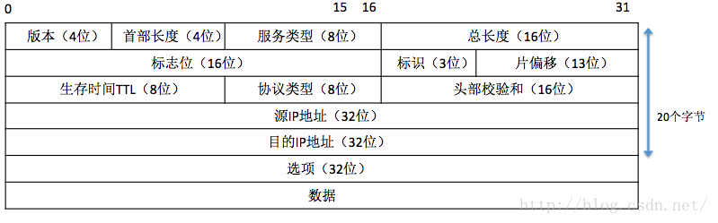
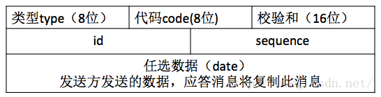
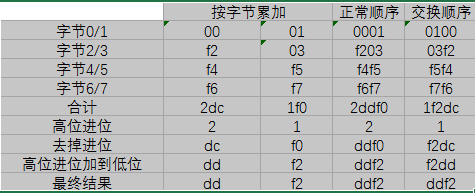

# 简易ping命令实现

## 1 IP协议报文

IP报文由报文头部和数据两部分构成：



其中，首部长度字段占4位，可表示的最大十进制数值是15。注意：这个字段所表示数的单位是32位字(1个32位字长是4字节)。因此，当IP的首部长度为1111时(即十进制的15)，首部长度就达到60字节。故可以**取首部长度字段出来，将其乘以4，就得到了整个IP报文的头部长度**。

## 2 ICMP协议报文

ICMP查询请求和应答消息格式ICMP回应请求(echo-request：类型8编码0)和应答消息(echo-reply：类型0编码0)用于诊断两个系统(主机或路由器)之间是否能够进行通信。当其中一方发送回应请求消息给另一方时，接收到回应请求消息的主机或者路由器将以应答消息进行应答，ping命令就基于此消息类型。如下图所示，其中type字段为8表示回应请求，0表示应答；校验和checksum字段包括头部和数据两部分的计算结果：



## 3 两种报文之间的关系

ICMP不是高层协议，而是IP层的协议，因为**ICMP报文是IP数据包的数据部分**，承载在IP分组中作为IP的有效载荷。当一台主机收到一个指明上层协议为ICMP的IP数据报时，它分解出该数据报的内容**给ICMP**。

因此，要实现简易的ping命令，大致的内部执行过程为：

1. 在本地，将ICMP协议报文进行封装；
2. 本机通过socket管道向目的主机**发送ICMP数据报**；
3. 目的主机通过发送响应的实际主机，向本机回复IP响应报文；
4. 本机在IP响应报文中，**解析出IP数据报的数据部分，即为ICMP响应报文**。通过判断消息类型、标识符，计算校验和等方式，判断是不是正确的ICMP响应报文。如果正确，就计算：回复主机发送响应数据报时和本机收到响应数据报时的往返时延，并将信息输出至屏幕；如果不正确，就丢弃这个数据包。

## 4 校验和计算

### 4.1 思路

IP、ICMP、UDP和TCP报文头都有检验和字段，大小都是16bit，算法基本上都是一样的。

在发送数据时，按如下步骤计算数据包的检验和：

```
1、把校验和字段设置为0；
2、把需要校验的数据看成以16位为单位的数字组成，依次进行二进制求和，然后取反码；
3、把得到的结果存入校验和字段中。
```

在接收数据时，按如下步骤计算数据包的检验和：

```
1、把首部看成以16位为单位的数字组成，依次进行二进制求和，包括校验和字段，然后取反码；
2、检查计算出的校验和的结果是否为0；
3、如果等于0，说明校验和正确。否则，校验和错误，协议栈抛弃这个数据包。
```

虽然说上面四种报文的校验和算法一样，但是在作用范围存在不同：IP校验和只校验20字节的IP报头；而**ICMP校验和覆盖整个报文(ICMP报头+ICMP数据)**；UDP和TCP校验和不仅覆盖整个报文，而且还有12个字节的IP伪首部，包括源IP地址(4字节)、目的IP地址(4字节)、协议(2字节)、TCP/UDP包长(2字节)。另外UDP、TCP数据报的长度可以为奇数字节，所以在计算校验和时需要在最后增加填充字节0(填充字节只是为了计算校验和，可以不被传送)。

### 4.2 处理

```
对于一个无符号数，从低位到高位相加。因为校验和字段为16位，因此，若最后相加得到的结果大于0xffff，就把高位加到低位。最后，再将求得的和取反码。
```

### 4.3 优点

二进制反码循环移位加法求和的优点是：不依赖系统是大端还是小端。例如：第0~7字节是type字段，为00001000；第8~15字节是code字段，为00000001。求和时按照16位为一个单位对ICMP报文结构体读取，而在X86架构的CPU上默认以小端法进行存储，高地址存储在高位，因此，读取到的结果是00000001 00001000。而网络字节序采用的是大端法，因此，需要调用ntohs函数进行转换。

而二进制反码循环移位加法与字节序无关，即无论是发送方还是接收方在检查校验和时，都不需要调用htons或者ntohs，直接通过上面的算法就可以得到正确的结果。如，对于一串16进制数据0001f203f4f5f6f7：



不管是大端法还是小端法，读取结果相同。并且，关于二进制反码循环移位求和运算需要说明的一点是：先取反后相加与先相加后取反，得到的结果是一样的。

## 5 运行

- 操作系统：Ubuntu 20.04
- make

因为用到**原始套接字**，所以要加上sudo：

```shell
make
sudo ./ping [hostname/IP Address]
make clean
```

1. 标准套接字分为：
     1. 流式套接字(SOCK_STREAM)：面向连接的套接字，应用于TCP应用程序；
     2. 数据包套接字(SOCK_DGRAM)：无连接的套接字，应用于UDP应用程序。
2. 原始套接字，是一种对原始网络报文进行处理的套接字，指在传输层下面使用的套接字，主要用途有：
     1. 发送自定义的IP数据包；
     2. 发送ICMP数据包；
     3. 网卡的侦听模式，监听网络上的数据包；
     4. 伪装IP地址；
     5. 自定义协议的实现。

## 参考资料

1. [IP协议报文和ICMP协议报文](https://blog.csdn.net/u014634338/article/details/48951345)
2. [校验和计算原理](https://blog.csdn.net/axiqia/article/details/52704061?utm_medium=distribute.pc_aggpage_search_result.none-task-blog-2~aggregatepage~first_rank_ecpm_v1~rank_aggregation-2-52704061.pc_agg_rank_aggregation&utm_term=icmp%E6%A0%A1%E9%AA%8C%E5%92%8C%E5%8E%9F%E7%90%86&spm=1000.2123.3001.4430)
3. [大小端模式](https://baike.baidu.com/item/%E5%A4%A7%E5%B0%8F%E7%AB%AF%E6%A8%A1%E5%BC%8F/6750542?fr=aladdin)
4. [标准套接字和原始套接字](https://www.cnblogs.com/wanghao-boke/p/11655015.html)